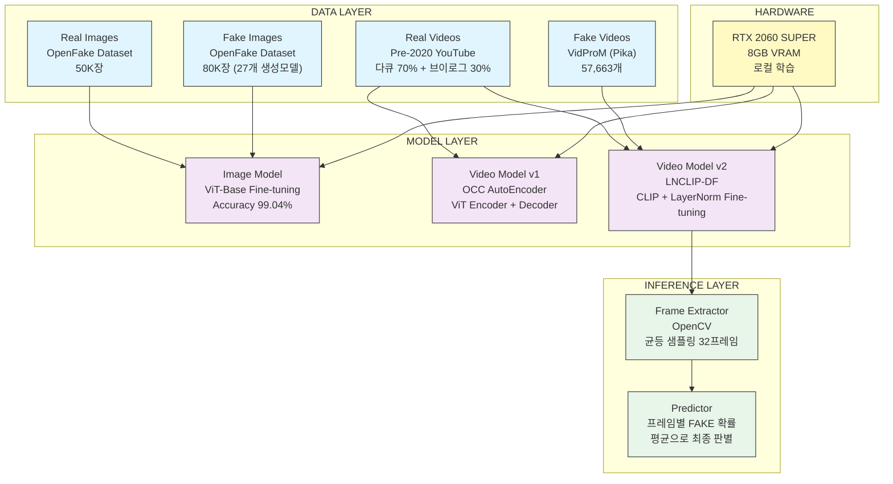
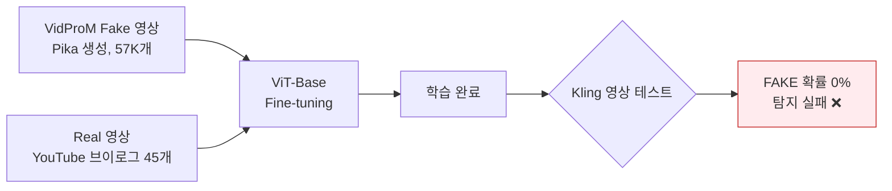
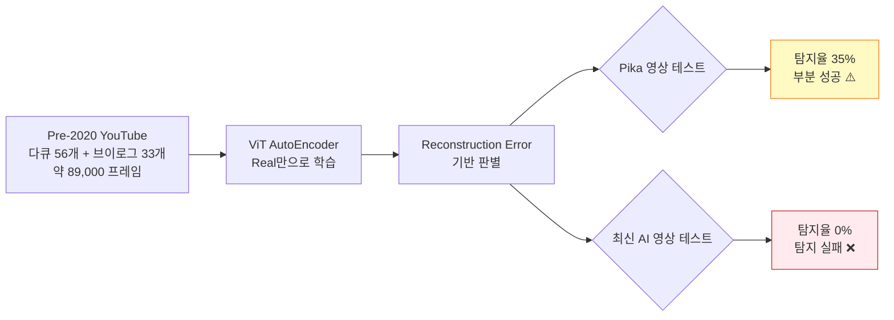
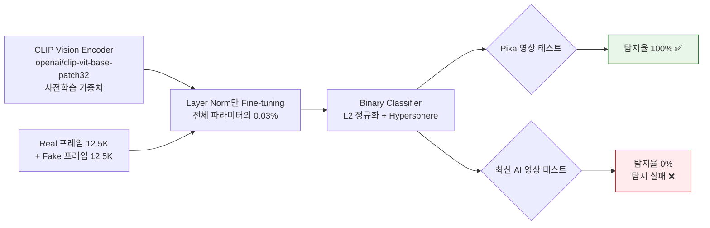
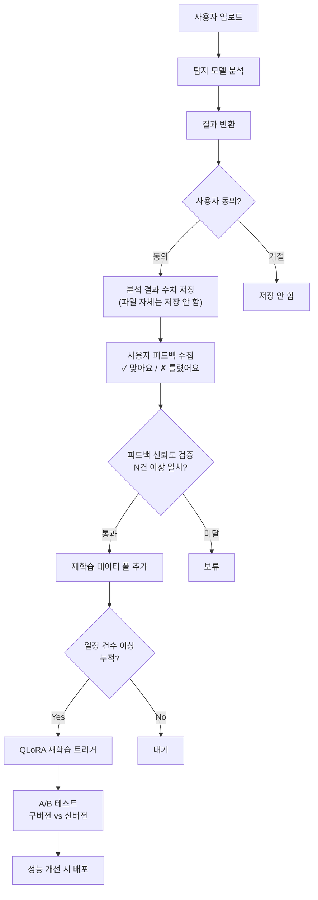

# 🎭 DeepFake Detector — AI 생성 미디어 탐지 시스템

> 이미지 및 영상이 AI로 생성된 것인지 실제 촬영된 것인지 탐지하는 딥러닝 기반 탐지 시스템

---

## 📋 프로젝트 개요

SNS와 미디어 환경에서 AI 생성 이미지·영상이 급격히 확산됨에 따라, 이를 탐지하기 위한 시스템의 필요성이 대두되고 있습니다.  
본 프로젝트는 세 가지 접근법을 직접 실험하고 각각의 한계와 개선 방향을 도출하는 과정을 통해 **AI 생성 미디어 탐지의 본질적 어려움**을 연구한 포트폴리오 프로젝트입니다.

### 🎯 핵심 목표

- 이미지/영상 모달리티에서 AI 생성 여부 탐지
- 다양한 탐지 방법론 실험 및 비교 분석
- Out-of-distribution 일반화 문제 탐구

---

## 🏗️ 전체 시스템 아키텍처



---

## 🧪 실험 과정

### Phase 1 — 이미지 탐지 (성공)

#### 실험 1-1: CIFAKE 데이터셋

- **데이터**: CIFAKE (Real 50K + Fake 50K, Stable Diffusion v1.x, 32×32px)
- **모델**: ViT-Base-patch16-224 Fine-tuning
- **결과**: Test Accuracy 99.3%
- **문제**: 2022년 이전 생성 모델 기반 → 최신 AI 이미지 탐지 불가

#### 실험 1-2: OpenFake 데이터셋 (최종 채택)

- **데이터**: ComplexDataLab/OpenFake (Real 50K + Fake 80K, 27개 최신 생성 모델)
  - Grok-2, GPT Image 1, Midjourney v6/v7, Flux, DALL-E 3, Imagen 3/4, Ideogram, HiDream, Chroma 등
- **모델**: ViT-Base-patch16-224 Fine-tuning
- **트러블슈팅**:
  - EfficientNet-B4 OOM → B0으로 교체 (파라미터 1,900만 → 540만)
  - 워터마크 Shortcut Learning 발견 → `Resize(256)→CenterCrop(200)→Resize(224)` transform으로 해결
- **최종 결과**:

| Metric | Score |
|--------|-------|
| Accuracy | 99.04% |
| F1 Score | 0.9904 |
| AUC | 0.9989 |

---

### Phase 2 — 영상 탐지 (실험 및 한계 분석)

#### 실험 2-1: Binary Classification (VidProM/Pika)



- **실패 원인**: Pika 특유의 패턴에 overfitting → 다른 생성 모델 영상 탐지 불가
- **교훈**: 특정 생성 모델 패턴 학습 방식으로는 SNS 가짜뉴스 탐지 목표 달성 불가

#### 실험 2-2: One-Class Classification (OCC AutoEncoder)



- **학습 곡선**: 30 에폭, MSE Loss 0.028 → 0.001 수렴
- **Threshold 설정**: mean + 2×std = 0.00130 (real 오탐율 ~2%)
- **실패 원인**: 최신 AI 생성 영상의 품질이 너무 높아 real과 reconstruction error 분포가 겹침

#### 실험 2-3: LNCLIP-DF (Layer Norm Fine-tuning)



- **학습 결과**: val_acc 100% (3 에폭부터 수렴, 18 에폭 조기 종료)
- **실패 원인**: 학습 데이터(Pika)에 없는 생성 모델 영상은 탐지 불가 → out-of-distribution 한계

---

## 📊 실험 결과 비교

| 실험 | 방법론 | Pika 탐지율 | 최신 AI 영상 탐지율 | 비고 |
|------|--------|:-----------:|:-----------------:|------|
| Binary (Pika) | ViT Fine-tuning | - | 0% | Kling 테스트 실패 |
| OCC AutoEncoder | ViT AE + MSE | 35% | 0% | Threshold 기반 판별 |
| LNCLIP-DF | CLIP + LayerNorm | 100% | 0% | 학습 분포 외 일반화 실패 |

> **핵심 발견**: 어떤 방법론을 사용하더라도 학습 데이터에 없는 생성 모델의 영상은 탐지하지 못하는 **Out-of-distribution 일반화 문제**가 딥페이크 탐지의 본질적 과제임을 확인. 이는 현재 연구 최전선(Deepfake-Eval-2024 논문)에서도 동일하게 보고된 문제임.

---

## 📓 노트북 구성 및 역할

### Phase 1 — 이미지 탐지

| 파일명 | 역할 |
|--------|------|
| `01_EDA.ipynb` | CIFAKE 데이터셋 탐색적 데이터 분석. 클래스 분포, 샘플 이미지 시각화, 해상도 분포 확인 |
| `02_download_openfake.ipynb` | HuggingFace에서 OpenFake 데이터셋 스트리밍 방식으로 다운로드. RGBA→RGB 변환, 손상 이미지 예외처리, 이어받기 로직 포함. 최종 real 50,000장 / fake 78,444장 (27개 모델) 수집 완료 |
| `03_EDA_openfake.ipynb` | OpenFake 데이터셋 EDA. 모델별 데이터 분포 시각화, 평균 해상도(770×756) 확인, 샘플 이미지 시각화 |
| `04_train.ipynb` | Phase 1 이미지 모델 학습. ViT-Base 파인튜닝(OpenFake 기준), 클래스 불균형 가중치 적용, 체크포인트 저장/이어받기, 매 에폭 best_model 저장. 최종 Accuracy 99.04% / F1 0.9904 / AUC 0.9989 |
| `06_evaluate.ipynb` | 이미지 모델 + 영상 모델 통합 평가. Accuracy·F1·AUC·confusion matrix 계산, 학습 곡선 시각화, 두 모델 성능 비교 막대 그래프 출력 |
| `07_inference.ipynb` | 이미지/영상 단건 추론. 이미지 real/fake 판별 및 결과 시각화, 영상 프레임 균등 추출 후 프레임별 FAKE 확률 시각화 |
| `08_train_efficientnet.ipynb` | EfficientNet 학습 시도 기록. B4 → RTX 2060 SUPER OOM으로 B0 교체 후 설정 구성 중 워터마크 Shortcut Learning 문제 발견, CenterCrop transform 수정 결정 후 실험 중단. 문제 발견 과정 기록용 |

### Phase 2-v1 — Binary Classification (영상)

| 파일명 | 역할 |
|--------|------|
| `05_train_video.ipynb` | VidProM(Pika) 기반 영상 Binary Classification 학습. 프레임 추출(fake 1,000개×100프레임, real 45개×1,000프레임), ViT 파인튜닝, Windows DataLoader 멀티프로세싱 오류 해결(num_workers=0). Kling 영상 테스트에서 FAKE 확률 0% — 탐지 실패 |

### Phase 2-v2 — Real 영상 수집 및 OCC 학습

| 파일명 | 역할 |
|--------|------|
| `10_download_real_videos.ipynb` | yt-dlp YouTube 영상 수집. pre-2020 날짜 필터링, 영상 길이 필터(1분~60분), resume 로직. 다큐 56개 + 브이로그 33개 최종 수집 |
| `11_extract_frames.ipynb` | 수집된 real 영상에서 프레임 추출. 5프레임 간격 균등 추출, 영상당 1,000프레임, 진행상황 저장/이어받기 로직. 총 약 89,000프레임 추출 |
| `12_train_occ.ipynb` | OCC(One-Class Classification) AutoEncoder 학습. ViT 인코더 + 패치 단위 디코더 구성, real 데이터만으로 학습, MSE Loss 기반 reconstruction error 최소화, 30 에폭 학습 |
| `13_threshold.ipynb` | OCC 모델의 판별 threshold 설정. val 데이터 reconstruction error 분포 분석, mean+2×std / mean+3×std 비교, 오탐율 계산, threshold.json 저장 |
| `14_inference.ipynb` | OCC 모델 추론. 이미지/영상 단건 테스트, 프레임별 error 시각화, Pika 영상 배치 테스트(탐지율 35% 확인), 최신 AI 영상 테스트(탐지율 0% 확인) |

### Phase 2-v3 — LNCLIP-DF

| 파일명 | 역할 |
|--------|------|
| `15_train_clip.ipynb` | LNCLIP-DF 학습. CLIP vision encoder 로드, LayerNorm 파라미터만 unfreeze(전체의 0.03%), L2 정규화 + Hypersphere feature manifold 적용, Binary Classification, 클래스 불균형 언더샘플링. val_acc 100% (3에폭부터 수렴, 18에폭 조기 종료) |
| `16_inference_clip.ipynb` | LNCLIP-DF 추론. 이미지/영상 단건 테스트, Pika 영상 배치 테스트(탐지율 100% 확인), 최신 AI 영상 테스트(탐지율 0% 확인), 프레임별 FAKE 확률 시각화 |

---

## 🔍 문제 분석 및 개선 방향

### 1. Out-of-distribution 일반화 문제

**현상**: 학습 데이터의 생성 모델(Pika)은 탐지하지만 다른 생성 모델(Kling, Sora 등)은 탐지 실패

**개선 방향**:
- **페어 데이터 활용**: FaceForensics++, DeepSpeak v2 같은 real-fake 페어 데이터셋으로 학습 → shortcut learning 방지
- **다양한 생성 모델 혼합**: Pika, Runway, Kling, Sora 등 여러 생성 모델 영상을 골고루 학습
- **Cross-dataset 검증**: 단일 데이터셋 성능이 아닌 다양한 벤치마크에서 검증 (Deepfake-Eval-2024 등)

### 2. Shortcut Learning 문제

**현상**: OpenFake 데이터셋의 워터마크를 학습해서 워터마크 유무로 real/fake 판별

**적용한 해결책**: `Resize(256) → CenterCrop(200) → Resize(224)` transform으로 테두리 제거

**추가 개선 방향**:
- 다양한 augmentation 적용 (RandomCrop, ColorJitter 등)
- 워터마크 감지 전처리 모듈 추가

### 3. 데이터 품질 문제

**현상**: OCC 학습용 real 데이터에 일러스트/그림체 이미지 혼재

**개선 방향**:
- NIQE, BRISQUE 등 이미지 품질 지표로 실제 사진만 필터링
- 얼굴 감지 모델로 사람이 포함된 영상만 선별

### 4. 지속 학습 파이프라인 (미구현 — 설계)

새로운 생성 모델이 계속 등장하는 환경에 대응하기 위한 설계:



**고려사항**:
- **피드백 신뢰도**: 악의적 피드백 필터링 로직 필요
- **데이터 균형**: 편향된 피드백 데이터로 인한 모델 편향 방지
- **재학습 주기**: 일정 건수 또는 일정 기간 기반 스케줄링
- **모델 버전 관리**: 성능 하락 방지를 위한 롤백 메커니즘
- **개인정보 보호**: 파일 자체 저장 없이 분석 수치만 저장, 사용자 동의 필수

---

## 🔧 기술 스택

### AI/ML
- **PyTorch** — 딥러닝 프레임워크
- **HuggingFace Transformers** — ViT, CLIP 모델 로드 및 파인튜닝
- **OpenCV** — 영상 프레임 추출
- **scikit-learn** — 데이터 분할, 평가 지표

### 모델
- `google/vit-base-patch16-224-in21k` — 이미지 탐지 (Phase 1), OCC AutoEncoder (Phase 2-v1)
- `openai/clip-vit-base-patch32` — LNCLIP-DF (Phase 2-v2)

### 데이터 수집
- **HuggingFace Datasets** — OpenFake 스트리밍 다운로드
- **yt-dlp** — YouTube pre-2020 영상 다운로드

### 개발 환경
- **Python 3.10** + **conda** 가상환경 (`deepfake`)
- **Jupyter Notebook** — 실험 및 분석
- **Windows 10** + **RTX 2060 SUPER (8GB VRAM)** — 학습용

---

## 📁 프로젝트 구조

```
deepfake-detector/
├── data/
│   ├── openfake/
│   │   ├── real/               # 50,000장
│   │   └── fake/               # 80,000장 (27개 모델)
│   ├── real_videos/
│   │   ├── documentary/        # 56개 영상 (.mp4)
│   │   └── vlog/               # 33개 영상 (.mp4)
│   ├── real_frames/
│   │   ├── documentary/        # ~56,000 프레임 (.jpg)
│   │   └── vlog/               # ~33,000 프레임 (.jpg)
│   └── vidprom/
│       ├── pika_fake/          # 57,663개 영상
│       └── frames/fake/        # 12,521 프레임
│
├── models/
│   ├── openfake/               # Phase 1 이미지 모델
│   │   ├── best_model.pth
│   │   ├── checkpoint.pth
│   │   └── history.json
│   ├── occ/                    # Phase 2-v1 OCC 모델
│   │   ├── best_model.pth
│   │   ├── threshold.json
│   │   ├── loss_curve.png
│   │   └── threshold_distribution.png
│   └── clip_lndf/              # Phase 2-v2 LNCLIP-DF 모델
│       ├── best_model.pth
│       ├── checkpoint.pth
│       └── train_curve.png
│
├── notebooks/
│   ├── 01_EDA.ipynb
│   ├── 02_download_openfake.ipynb
│   ├── 03_EDA_openfake.ipynb
│   ├── 04_train.ipynb
│   ├── 05_train_video.ipynb
│   ├── 06_evaluate.ipynb
│   ├── 07_inference.ipynb
│   ├── 08_train_efficientnet.ipynb
│   ├── 09_train_vit_scratch.ipynb
│   ├── 10_download_real_videos.ipynb
│   ├── 11_extract_frames.ipynb
│   ├── 12_train_occ.ipynb
│   ├── 13_threshold.ipynb
│   ├── 14_inference.ipynb
│   ├── 15_train_clip.ipynb
│   └── 16_inference_clip.ipynb
│
└── test_samples/
    ├── image/
    │   ├── real/
    │   └── fake/
    └── video/
        ├── real/
        └── fake/
```

---

## 🚀 실행 방법

### 환경 설정

```bash
conda create -n deepfake python=3.10
conda activate deepfake
pip install torch torchvision transformers
pip install opencv-python scikit-learn matplotlib pillow datasets yt-dlp
```

### 이미지 탐지 (Phase 1)

```bash
# 1. 데이터 다운로드
jupyter notebook notebooks/02_download_openfake.ipynb

# 2. 학습
jupyter notebook notebooks/04_train.ipynb

# 3. 추론
jupyter notebook notebooks/07_inference.ipynb
```

### 영상 탐지 — LNCLIP-DF (Phase 2-v2)

```bash
# 1. Real 영상 수집
jupyter notebook notebooks/10_download_real_videos.ipynb

# 2. 프레임 추출
jupyter notebook notebooks/11_extract_frames.ipynb

# 3. 학습
jupyter notebook notebooks/15_train_clip.ipynb

# 4. 추론
jupyter notebook notebooks/16_inference_clip.ipynb
```

---

## 📈 트러블슈팅 기록

| 문제 | 원인 | 해결 |
|------|------|------|
| EfficientNet-B4 OOM | 파라미터 1,900만 개, 8GB VRAM 부족 | EfficientNet-B0으로 교체 (540만 개) |
| 워터마크 Shortcut Learning | OpenFake 일부 이미지에 AI 생성 워터마크 존재 | CenterCrop으로 테두리 제거 |
| Windows DataLoader hang | `num_workers=4` 멀티프로세싱 충돌 | `num_workers=0`으로 설정 |
| Kling 영상 탐지 실패 | Pika 데이터만 학습 → overfitting | OCC, LNCLIP-DF 방향 전환 |
| OCC 재구성 오차 겹침 | 최신 AI 영상 품질이 real과 유사 | LNCLIP-DF 방향 전환 |
| CLIP 학습 3에폭부터 acc 100% | 학습 분포 내 데이터 빠른 수렴 | 18 에폭 조기 종료 |

---

## 🔬 참고 논문 및 데이터셋

### 논문

- **LNCLIP-DF**: *Deepfake Detection that Generalizes Across Benchmarks* (2025)
- **OpenFake**: *An Open Dataset and Platform Toward Real-World Deepfake Detection* (2025)
- **RLNet**: *Design and development of an efficient RLNet prediction model for deepfake video detection* — Frontiers in Big Data (2025)
- **Deepfake-Eval-2024**: *A Multi-Modal In-the-Wild Benchmark of Deepfakes Circulated in 2024* (2025)

### 데이터셋

- **ComplexDataLab/OpenFake** — [HuggingFace](https://huggingface.co/datasets/ComplexDataLab/OpenFake)
- **WenhaoWang/VidProM** — [HuggingFace](https://huggingface.co/datasets/WenhaoWang/VidProM)
- **CIFAKE** — [Kaggle](https://www.kaggle.com/datasets/birdy654/cifake-real-and-ai-generated-synthetic-images)

---

## 💡 결론

본 프로젝트는 Claude를 활용한 바이브 코딩 방식으로 진행했습니다. 실험 설계, 데이터 수집 전략, 결과 해석, 방향 전환 판단은 직접 수행하고, 실제 코드 작성은 AI와 협업하는 방식으로 개발했습니다.
이 과정에서 AI 생성 미디어 탐지의 본질적 과제를 직접 경험했습니다. AI 모델 학습 과정에서 새로운 모델들이 생성하는 영상들은 본 프로젝트를 수행하는 과정에서 잡아내지 못했고, 매년 비약적으로 발전하는 AI산업 특성상 주기적으로 학습을 통해 강화를 시켜주는 것이 중요하다고 느꼈습니다

---

*개발 환경: Windows 10, RTX 2060 SUPER (8GB VRAM), Python 3.10, PyTorch*
